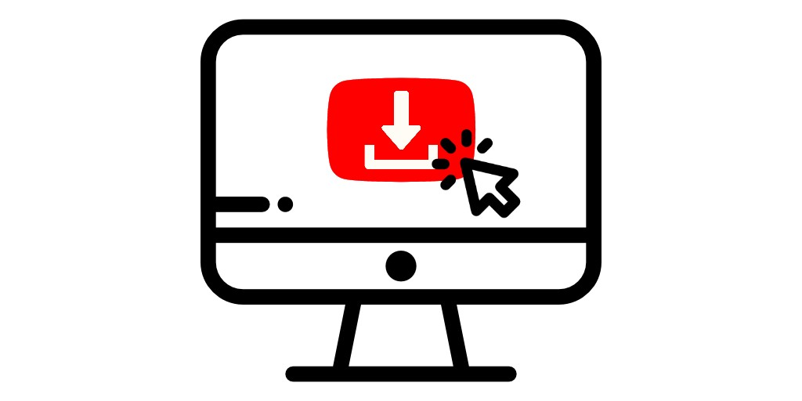
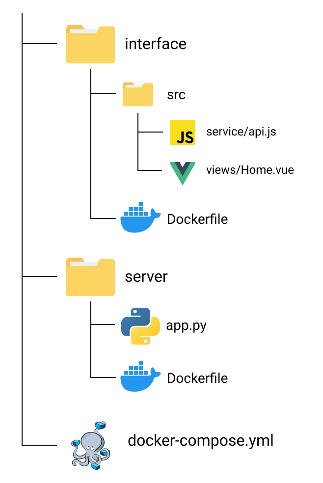

    

# youtube-dl-interface

The goal of this project is to offer an easy way to download youtube videos (mp3 for audio or mp4 for  video).

It is based on youtube-dl so check it out !
https://youtube-dl.org/

## Features
- Download of single youtube video as video (mp4) or audio (mp3).

*URL like https://www.youtube.com/watch?v=dQw4w9WgXcQ*

- Download of playlist as zip archive (also video or audio).

*URL like https://www.youtube.com/playlist?list=PL2R75x3ZazUDRZKsDU9-pi85DJ3WdGudI* 

- Support UTF-8 characters (hello K-pop fans)

## Content
This project contains:
- a [VueJS](https://vuejs.org/) application called interface which provides a web page
- a [Flask](https://flask.palletsprojects.com/) application called server, this one is running the downloads
- a [Docker](https://www.docker.com/) configuration for running both

## Architecture

    

## Requirements
- Docker 1.13.0+
- npm / yarn

## Project setup

- Clone the project

- Install the dependencies:
    - `cd interface`
    - `npm install`
    - `cd ..`

- Setup your environment: `cp .env.example .env`

You can choose the video quality of the downloads by setting the VIDEO_QUALITY variable.

*Be aware that this will only impact the speed of the download and that this is highly dependent on your download speed.*

- Running the project: `docker-compose up`

- Go to `localhost:8080` on your browser and start downloading your favorites videos !

## Future possible features
- Logger to follow the progress of the download (especially for playlists)
- Add other pages to interface (About, etc.)
- Add page with more options for the download (specific format, etc.)

## Things to do
- Enhance the interface

## References
- youtube-dl: 
https://github.com/ytdl-org/youtube-dl

- youtube-dl-server by manbearwiz:
https://github.com/manbearwiz/youtube-dl-server
